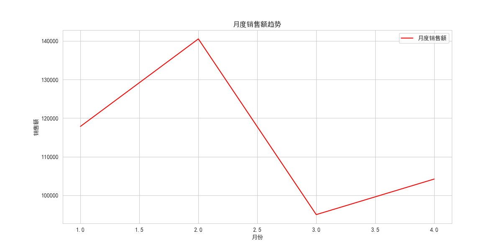
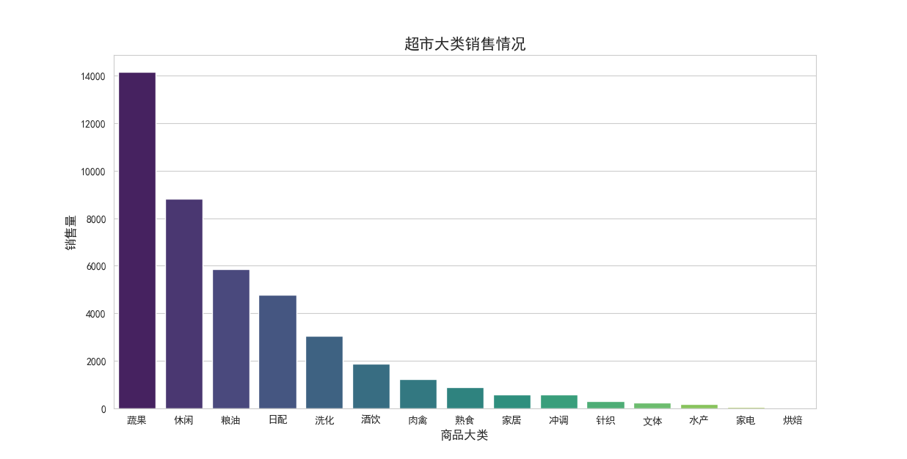

# 🏬 超市销售数据分析项目

[](https://www.python.org/)
[](https://opensource.org/licenses/MIT)
[](https://colab.research.google.com/github/IanErin/market_sales-analysis/)

基于2015年1月至4月超市销售数据的多维度分析，挖掘消费规律、客户价值与节假日效应，为运营优化提供数据支持。

## 📌 项目概览

本项目对某超市2015年第一季度（1-4月）的销售数据进行了全面分析，涵盖**时间维度、商品类别、订单特征、顾客行为**四大方向。通过数据清洗、可视化、RFM客户分层等方法，识别关键业务洞察，并提出可落地的运营建议。

项目目标：
- 理解节日期间的消费趋势
- 识别高价值客户与核心商品品类
- 支持精准营销与库存优化决策

---

## 🧰 技术栈

| 类别 | 工具 |
|------|------|
| 数据分析 | Python, Pandas, NumPy |
| 数据可视化 | Matplotlib, Seaborn |
| 环境 | Jupyter Notebook |
| 报告输出 | Markdown, HTML, PDF |

---

## 🔍 分析维度与关键发现

### 1. 时间维度
- **春节效应显著**：2015年春节（2月19日）前两周为销售高峰，2月3日和2月18日为单日销量最高。
- **月度对比**：2月销售额最高，3月最低，呈现明显节后回落趋势。

### 2. 商品类别
- **主导品类**：蔬果（33.15%）、休闲食品（20.68%）、粮油（13.71%）是销售额前三。
- **畅销子类**：袋装薯片、花果类蔬果、榨菜等表现突出。
- **滞销品类**：电吹风、热水袋等耐用品销量低，建议捆绑促销。

### 3. 订单特征
- 平均订单金额：51元，中位数33元
- 67%的订单金额低于50元，说明以日常小单为主
- 单笔最高消费达13080元（2月3日烟酒类），体现节日送礼需求

### 4. 顾客行为（RFM分析）
| 顾客等级 | 人数 | 占比 |
|----------|------|------|
| 重要价值客户 | 652 | 24.96% |
| 重要保持客户 | 620 | 23.74% |
| 一般客户 | 1084 | 41.50% |
- 总顾客数：2612人，复购率：51.72%

---

## 📈 可行性建议

1. **优化节假日营销策略**  
   提前布局春节促销，推出“年货礼盒”组合，重点推广烟酒、休闲食品。

2. **实施客户分层运营**  
   针对“重要价值客户”推送专属优惠，唤醒“重要保持客户”提升购买频率。

3. **商品结构优化**  
   保障高销量品类供应，对低销量耐用品进行捆绑销售或限时折扣。

4. **提升客单价**  
   设置“满59减10”等阶梯优惠，引导顾客凑单。

---

## 📊 可视化示例


> 图：2015年1-4月销售额趋势（2月为高峰）


> 图：各品类销售额前10（蔬果类销售额最高）

---

## 📎 数据说明

- 数据时间范围：2015年1月1日 - 2015年4月30日
- 字段包括：销售日期、顾客编号、商品大类/小类、销售数量、销售金额等
- ⚠️ **局限性**：
  - 数据仅覆盖4个月，难以分析全年趋势
  - 缺少顾客属性（年龄、性别）与商品成本信息

---

## 🚀 使用方法

1. 克隆项目：
   ```bash
   git clone https://github.com/IanErin/market_sales-analysis.git
